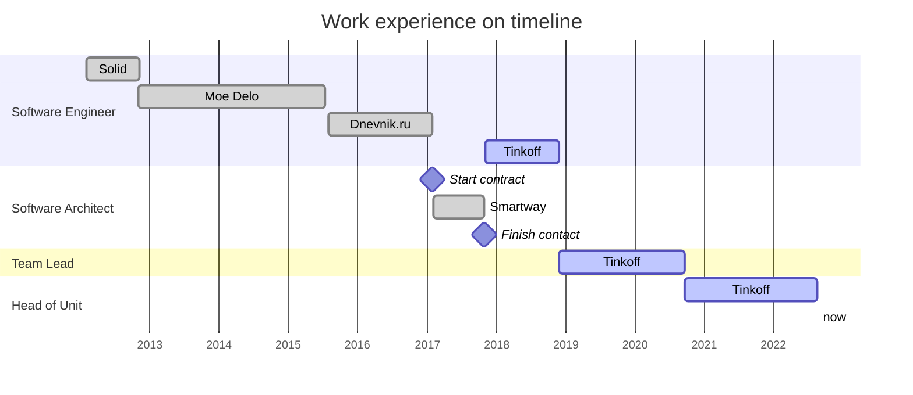

# Maxim Chechulnikov
## Software Development Engineer / Architect / Team Lead. 10 years of experience. 

| Item | Info |
| :--- | ---: |
|Date of birth | June 11, 1990
|Current location | Saint Petersburg, Russia
|Phone | +7 (995) 595-32-64
|Email | ilfirin.nar@gmail.com

Key skills:
- Design and development of scalable data-intensive software systems
- Management of 
	- up to 5 dev teams
	- up to 7 team leads / architects
	- and up to 50 employees overall
- Delivery management (processes building)

Primary tech stack right now is Go

Interested in functional programming, Haskell, Elm, PureScript

Experienced with .NET, ASP.NET Core, MS SQL Server, MongoDB, Redis, RabbitMQ, Kafka, JavaScript / TypeScript, Angular, PowerShell / Bash, Linux containers, Docker

## Experience

### [Tinkoff](https://www.tinkoff.ru ) | Head Of Dev Unit | St.Petersburg, Russia | 2017 – current time
One of the most advanced Russian fintech company. 
- Organised technological process of scaling internal services for building world-wide operational platform, lift & shift to clouds
- Management of one dev unit (50+ employees, 5 teams, 7 team leads/architects).
- Process building, product architecture, people management: teams’ professional skills development, engineering culture promotion, teams’ issues resolution, hiring, interviewing, and onboarding, building relationships with other units and teams 
- Service design and development of services for info support and training for remote employees: chat bots, notification & feedback services, digital workplace, tools for business process automation in zero/low code paradigm, etc
- Team processes automation

[About company](https://www.tinkoffgroup.com/company-info/summary/)

### [Smartway](https://smartway.today ) | Software Architect (contract work) | St.Petersburg, Russia | 2017
B2B SaaS for business trips. Web-project in which functionality expansion made it necessary to develop efficient complexity management and maintenance.

Reorganised service architecture and dev processes in a way that:
- system’s complexity should grow no faster than linear with functionality expansion;
- business has become less dependent on any single technology/platform and level of expertise of any one the team members;
- development process was less visible to users (continuous releases on hot-loaded system, etc.).

Following decisions were made:
- development and implementation of a transition from a monolithic to a service-oriented (microservice) architecture based on a cluster of Linux containers;
- implementation of a mechanism for service updates without stopping users’ work;
- backend components redesign;
- incorporation of new tools for a backend development: Go, Python, Linux containers

Transform to a distributed system is most often accompanied by a strong change in the infrastructure of the system as a whole, so main challenge for me was
- to prevent complexity of DevOps processes
- to minimise dependencies between components
- to provide flexible non-blocking integration of these components.

Technologies used: Go, .NET, MS SQL Server, MongoDB

### [Dnevnik.ru](https://dnevnik.ru) | SDE | St.Petersburg, Russia | 2015 – 2017
I’ve been involved in infrastructure-significant tasks for EdTech platform «Dnevnik.ru».

Analysis and implementation of a geo-distributed data-intensive application without any IaaS or cloud providers. As a result, the load was decreased more than 30% and a resharding subsystem was incorporated. It allowed to redistribute data in DB cluster in a background, without sufficient data access locking.

Technologies used: .NET, MS SQL Server, Redis, RabbitMQ

### [Moe Delo](https://www.moedelo.org) | SDE | Penza, Russia | 2012 – 2015
Over the course of 3 years implemented:
- mobile application backend API from scratch
- dramatically renewed user access system that allowed to support multiuser accounts
- new fares functionality
- refactoring and maintenance of infrastructure
- new leads attraction system based on network marketing
- accounting and tax calculation systems
- search engine by laws and legal documentation
- automated workplace for legal docs editors
- shift to micro services
- codebase and dependencies management convention
- DevOps processes improving
- rethinking and extension of corporate development standards

Technologies used: .NET, MS SQL Server

### Solid | SDE | Penza, 2012
Developed server-side of a video surveillance system. Adopted client-side application. Integrated with company’s other products

Technologies used: C++, Qt, GStreamer, IP cameras
