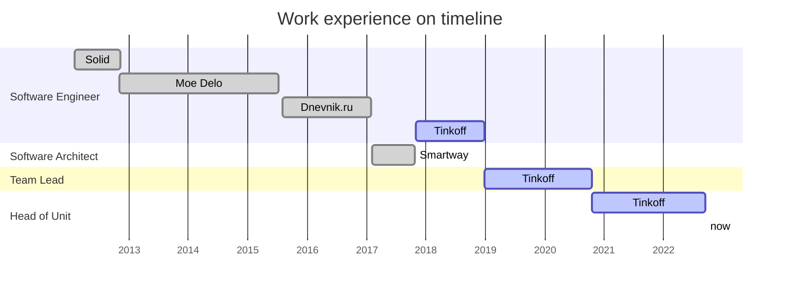

# Чечульников Максим
## Software Development Engineer / Architect / Teamlead. 10 лет опыта.

| Item | Info |
| :--- | ---: |
| Дата рождения | 11 июня 1990
| Город | Санкт-Петербург
| Телефон | +7 (995) 595-32-64
| Email | ilfirin.nar@gmail.com

Ключевые навыки:
- Проектирование и разработка масштабируемых и нагруженных систем
- Управление одной или несколькими командами разработки
- People management
- Delivery management

Основной стэк сейчас Go, Docker

Сильно интересуюсь: ФП, Haskell, Elm/PureScrip. В прошлом работал с .NET, ASP.NET Core, MS SQL Server, MongoDB, Redis, RabbitMQ, Kafka, JavaScript/TypeScript, Angular, PowerShell

## Опыт работы

### Тинькофф | Head Of Dev Unit | Санкт-Петербург, 2017 – настоящее время
- Управление отделом разработки (60+ чел, 5 команд, 5 тимлидов, 2 архитектора).
- Построение процессов, архитектура, работа с людьми в команде: процессы развития команды, повышением инженерной культуры, разрешение командных проблем, onboarding новых сотрудников, найм и проведение интервью, построением отношений с другими подразделениями.
- Организовал технологический процесс масштабирования и адаптации внутренних сервисов с целью построения операционной платформы и последующей монетизацией, включая lift & shift в AWS.
- Проектирование и разработка сервисов информационной поддержки и обучения сотрудников компании: коммуникационные боты-ассистенты, уведомления, сбор фидбэка, etc
- Улучшением автоматизации рутинных командных процессов – Slack-боты, скрипты различного назначения и т.д.

### Smartway | Sowftare Architect (контракт) | Санкт-Петербург, 2017
B2B SaaS комплексного бронирования командировок. С ростом количества функционала критически выросла необходимость эффективного управления сложностью и сопровождения.

Реорганизовал архитектуру приложения и процессы разработки таким образом, чтобы:
- с ростом количества функционала, сложность системы увеличивалась не быстрее чем линейно;
- бизнес стал менее зависим от какой-то одной технологии/платформы и уровня экспертных знаний членов команды в этой технологии;
- процессы разработки были менее заметны для пользователей ("бесшовные" релизы и т.п.).

Предпринял следующие меры:
- разработка и реализация плана по переходу с монолитной на сервис-ориентированную (микросервисную) архитектуру на базе кластера linux-контейнеров;
- осуществление механизма обновлений сервиса без остановки работы пользователей;
- создание и фиксация регламента оформления и проектирования компонентов серверной части сервиса;
- внедрение новых инструментов для разработки компонент (сервисов): Go, Python.

Переход к распределённой системе сопровождается сильным изменением инфраструктуры, поэтому основной challenge для меня состоял в том, чтоб
- не допустить усложнения процессов DevOps;
- минимизировать зависимости между компонентами;
- обеспечить гибкую не блокирующую интеграцию этих компонент.

### Дневник.ру | SDE | Санкт-Петербург, 2015 – 2017
Реализация инфраструктурно-значимых задач для школьного портала «Дневник.ру».

Аналитика и реализация гео-масштабирования нагруженного приложения без использования облачных провайдеров. В результате удалось снизить нагрузку на проблемные серверы более чем на 30% и реализовать подсистему решардинга – позволяет в фоновом режиме автоматически перераспределять данные в кластерах БД на добавленные узлы без существенной блокировки доступа к данным.

### Моё дело | SDE | Пенза, 2012 – 2015
На протяжении 3-ёх лет реализовал:
- API мобильного приложения с нуля
- кардинально обновлённая система пользовательского доступа, сделавшая возможной поддержку многопользовательских аккаунтов
- реализация функционала для новых тарифных планов
- рефакторинг и поддержка инфраструктурного кода сервиса
- система привлечения пользователей, основанная на сетевом маркетинге; 
- система ведения бухгалтерского и налогового учётов
- поисковый движок по нормативно-правовым документам
- ряд внутренних продуктов компании (автоматизированное рабочее место сотрудника редакции и программы утилитарного назначения)
- переход на микросервисную архитектуру
- налаживание процесса управления зависимостями и кодовой базой
- улучшении процесса сборки и развёртывания сервиса
- переосмыслении и расширению внутренних концептов и стандартов компании по методам ведения разработки и кодированию.

### Солид | SDE | Пенза, 2012
Разработал серверную часть системы охранного видео-наблюдения (C++, GStreamer, IP-камеры). Адаптировал клиентское приложение. Интегрировал систему с другими продуктами компании
